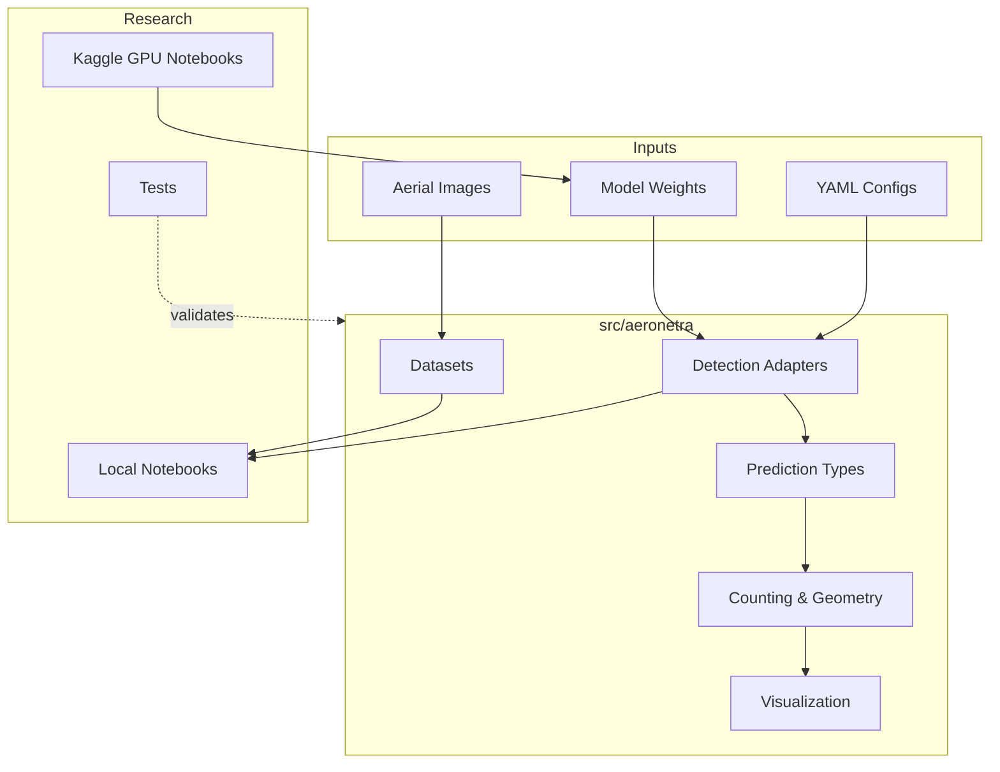
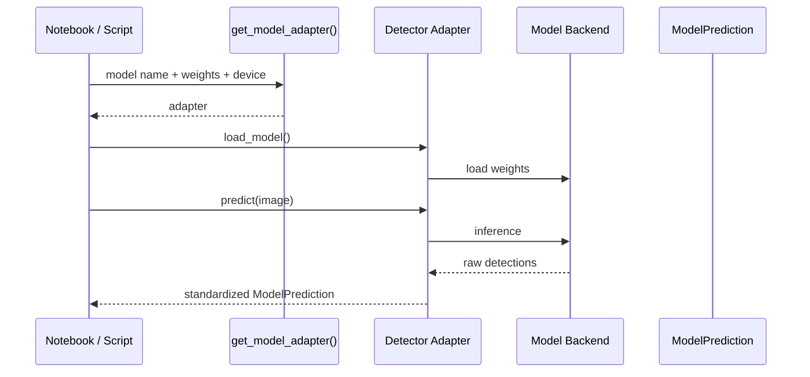
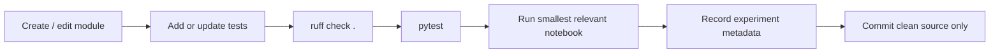

# Developer Guide

This guide explains how AeroNetra is organized and how to work on it without breaking reproducibility or mixing research phases.

## Architecture



## 1. Prerequisites

* Python 3.11
* Git
* `venv` or Conda
* Optional NVIDIA GPU for local acceleration
* Kaggle GPU for training/evaluation when local compute is insufficient

## 2. Install

```bash
git clone <repository-url>
cd AeroNetra-computervision
python -m venv venv
source venv/bin/activate
pip install -r requirements.txt
pip install -r requirements-dev.txt
pip install -e .
cp .env.example .env
```

On Windows, activate with `venv\Scripts\activate`.

Set `DATASET_DIR` in `.env` if your datasets live outside `data/raw/`.

## 3. Core design contract

All detectors must flow through the same interface:



Use package imports:

```python
from aeronetra.detection.adapters import get_model_adapter
from aeronetra.counting.ops import count_vehicles
```

Do **not** import through `src.aeronetra...` and do not instantiate model libraries directly in notebooks when an adapter exists.

## 4. Prediction data model

| Type                | Role                                          |
| ------------------- | --------------------------------------------- |
| `BoundingBox`       | Validated absolute `xyxy` coordinates         |
| `Detection`         | One object, class, confidence and box         |
| `ModelPrediction`   | Complete standardized prediction for an image |
| `CountSummary`      | Counting result                               |
| `InferenceMetadata` | Reproducibility metadata for an experiment    |

Filtering methods should return new prediction objects rather than silently mutating shared state.

## 5. Development workflow



### Quality commands

```bash
ruff check .
pytest
pytest tests/test_counting.py -v
```

Before committing notebooks:

```bash
jupyter nbconvert --clear-output --inplace notebooks/*.ipynb
```

## 6. Data rules

* Keep `data/raw/` immutable.
* Write conversions to `data/processed/`.
* Resolve dataset paths from configuration/environment variables.
* Never commit credentials, raw datasets, trained weights, or generated outputs.
* Validate converted datasets before training.

```bash
python scripts/validate_dataset.py --dataset-dir <path> --num-classes <n>
```

## 7. Local vs Kaggle

| Local machine               | Kaggle GPU                |
| --------------------------- | ------------------------- |
| Environment checks          | Training                  |
| Dataset inspection          | Full evaluation           |
| Small CPU inference         | Multi-model benchmarking  |
| Visualization and debugging | GPU-heavy comparison runs |

The intended loop is **prepare → train on Kaggle → download weights → analyze locally through the adapter interface**.

## 8. Do not accidentally expand scope


The current production-quality research path is static-image detection and counting. Tracking, geospatial analytics and edge deployment belong to later phases unless explicitly introduced with tests and documentation.


Avoid:

* fabricated benchmark values
* automatic downloads hidden inside notebooks
* hardcoded local filesystem paths
* direct model-specific logic scattered across notebooks
* applying YOLO-specific post-processing blindly to RT-DETR
