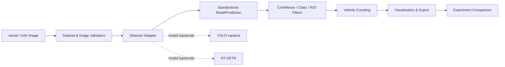
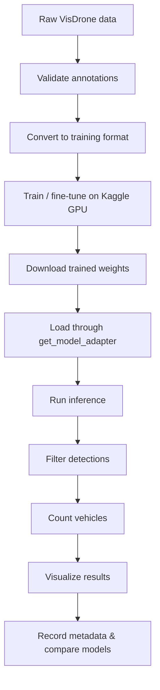
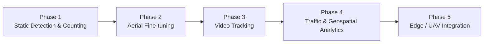

# AeroNetra Computer Vision

Currently The project focuses on counting the cars using the drone camera and separates reusable Python code, dataset tooling, model adapters, experiments, notebooks, and simulation work so that results remain understandable and reproducible.The project currently focuses on vehicle counting via drone imagery. It employs a modular architecture—cleanly separating reusable Python code, dataset tooling, model adapters, and simulation environments—to ensure all experimental results remain transparent and fully reproducible


**Current scope:** static-image vehicle detection and image-level counting. Video tracking, unique cross-frame counting, geospatial analytics, and edge deployment are later phases.


## System at a glance



The key design idea is simple: **models may differ, but downstream code should not have to.** Every supported detector is normalized into the same prediction structures before counting and visualization.

## What the repository contains

| Area                                   | Purpose                                                       |
| -------------------------------------- | ------------------------------------------------------------- |
| `src/aeronetra/detection/`             | Detector adapters and standardized prediction types           |
| `src/aeronetra/counting/`              | Filtering, NMS, ROI logic, counting, drawing and export       |
| `src/aeronetra/datasets/`              | Dataset parsing and conversion; VisDrone is implemented       |
| `src/aeronetra/visualization/`         | Plotting and visual analysis utilities                        |
| `configs/`                             | Dataset and inference configuration                           |
| `notebooks/`                           | Local exploration and inference workflow                      |
| `kaggle/`                              | GPU-oriented preparation, training, evaluation and comparison |
| `scripts/`                             | Dataset download and validation utilities                     |
| `tests/`                               | Automated tests and fixtures                                  |
| `px4_ros2_jazzy_gazebo_harmonic_sitl/` | PX4 + ROS 2 + Gazebo simulation documentation                 |

## End-to-end research workflow



### Prerequisites

* Python 3.10 or higher (developed on 3.12)
* OS: Linux, macOS, or Windows
* GPU (optional): A CUDA-capable GPU is required for training on Kaggle. Inference on CPU works but is slower; a GPU is recommended for batch inference.
* Disk space: \~3 GB for the VisDrone dataset and model weights

## Quick start

```bash
python -m venv venv
source venv/bin/activate   # Linux/macOS
# venv\Scripts\activate   # Windows

pip install -r requirements.txt
pip install -r requirements-dev.txt
pip install -e .
```

Configure dataset paths:

```bash
cp .env.example .env
```

Edit `.env` to set the following variables:

| Variable       | Description                                 | Example                    |
| -------------- | ------------------------------------------- | -------------------------- |
| `DATA_DIR`     | Root directory for raw datasets             | `/data/aeronetra`          |
| `VISDRONE_DIR` | Path to VisDrone dataset                    | `${DATA_DIR}/VisDrone2019` |
| `WEIGHTS_DIR`  | Directory for trained model weights         | `${DATA_DIR}/weights`      |
| `OUTPUTS_DIR`  | Directory for inference outputs and exports | `./outputs`                |

See [docs/ENVIRONMENT\_SETUP.md](docs/ENVIRONMENT_SETUP.md) for full setup details.

#### 3. Download a dataset

```python
python scripts/download_visdrone.py --output-dir data/VisDrone2019
```

Then verify the package:

```bash
python -c "import aeronetra; print(aeronetra.__version__)"
ruff check .
pytest
```

## Choose your path

<table data-view="cards"><thead><tr><th></th><th></th></tr></thead><tbody><tr><td><strong>Set up the project</strong></td><td><a href="docs/ENVIRONMENT_SETUP.md">Environment Setup</a></td></tr><tr><td><strong>Understand the data</strong></td><td><a href="docs/DATASETS.md">Datasets Guide</a></td></tr><tr><td><strong>Run a detector</strong></td><td><a href="docs/MODEL_INFERENCE.md">Model Inference Guide</a></td></tr><tr><td><strong>Understand counting</strong></td><td><a href="docs/COUNTING_METHODOLOGY.md">Counting Methodology</a></td></tr><tr><td><strong>Compare architectures</strong></td><td><a href="docs/MODEL_COMPARISON.md">Model Comparison</a></td></tr><tr><td><strong>See the roadmap</strong></td><td><a href="docs/RESEARCH_SCOPE.md">Research Scope</a></td></tr></tbody></table>

## Research principles

* **Reproducibility over impressive-looking demos.** Parameters, dataset split, model weights and timing should be recorded.
* **No fabricated benchmarks.** A model is not “best” until it is measured under the same evaluation conditions.
* **Raw data remains immutable.** Transformations go to processed directories.
* **Model-specific behavior stays inside adapters.** Counting code consumes standardized predictions.
* **Phase boundaries matter.** Image counting is not the same as multi-object tracking.

## Current roadmap




Some modules are intentionally incomplete. UAVDT support is stubbed, and later-phase tracking/analytics capabilities should not be presented as implemented functionality.

