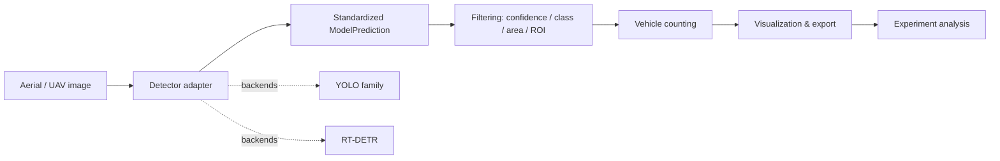
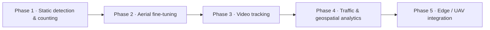

# 🛩️ AeroNetra Computer Vision

[](https://github.com/Pratyush061/AeroNetra-computervision/actions/workflows/tests.yml)
[](LICENSE)
[](pyproject.toml)
[](https://github.com/astral-sh/ruff)

> A modular, reproducible computer-vision platform for detecting and counting vehicles in aerial and UAV imagery.

AeroNetra is a research codebase for **static-image vehicle detection and image-level counting** from drone imagery. It is built around a single idea:

> **Change the detector without rewriting the rest of the perception pipeline.**

Model-specific behaviour is confined to detector *adapters*. Everything downstream — filtering, counting, visualization, experiment tooling — operates on one standardized prediction type, so a YOLO model and a transformer model are interchangeable to the rest of the system.

---

## 🌟 Highlights

- **One interface, many detectors.** `get_model_adapter(...)` returns a uniform adapter for YOLOv8, YOLO11, RT-DETR, and ONNX Runtime, so swapping models never changes downstream code.
- **Standardized predictions.** Every backend is normalized into `ModelPrediction` / `Detection` / `BoundingBox`, so counting and visualization never touch raw framework output.
- **A real dataset pipeline.** VisDrone is parsed, validated, and converted to YOLO format in either `merged` (single `vehicle` class) or `separate` (per-type) modes.
- **Counting + export built in.** Confidence/class/area/aspect/ROI filtering, OpenCV-based drawing, and JSON/CSV export ship as reusable library functions.
- **GPU work stays in Kaggle.** Heavy training and evaluation live in self-contained Kaggle notebooks; the local package stays light, installable, and testable on CPU.
- **Reproducibility by construction.** Shared `configs/inference/inference.yaml` and an `InferenceMetadata` record make experiments comparable instead of anecdotal.

---

## ℹ️ Overview

Aerial vehicle detection is not ordinary street-level detection. Objects are small, dense, frequently occluded, and seen from unusual angles. AeroNetra separates that problem into explicit layers so each one can be tested, replaced, and reasoned about independently:

| Layer | Responsibility |
| --- | --- |
| **Dataset** | Acquire, validate, convert, and organize training data |
| **Detection** | Run different model families behind one adapter interface |
| **Post-processing** | Confidence, class, geometry, ROI, and architecture-aware filtering |
| **Counting** | Produce image-level total and per-class vehicle counts |
| **Visualization** | Inspect predictions and export analysis artifacts |
| **Experiments** | Keep configurations, evaluation conditions, and comparisons explicit |

The current research phase is **Phase 1: static-image detection and counting**. Video tracking, persistent vehicle identities, geospatial analytics, and edge deployment are planned phases, not finished features.

### ✅ What is implemented

- **Detection** — `UltralyticsAdapter` covering the YOLO family (YOLOv8, YOLO11) and RT-DETR, plus `OnnxRuntimeAdapter` for exported ONNX models, behind the shared `BaseDetector` abstract interface and a factory function.
- **Counting** — coordinate conversion, clipping, area/aspect-ratio/ROI filtering, NMS, and image-level counting, with drawing and JSON/CSV export.
- **Datasets** — a VisDrone parser, class mapping, and YOLO-format converter, with fixtures and unit tests.
- **UAVDT** — a sequence-based DET parser, class mapping and YOLO converter, implemented from the documented UAVDT format (not yet verified against a real download).
- **Evaluation** — IoU matching, precision/recall/F1, mAP@50 and mAP@50-95, and count-error metrics (MAE/RMSE/bias/MAPE), with ground-truth loaders for YOLO and VisDrone labels and JSON report export.
- **Utilities** — deterministic seeding (`set_seed`), filesystem helpers (`ensure_dir`), and logging setup (`configure_logging`).
- **Tooling** — dataset download/validation scripts, a shared inference config, and a Ruff + pytest CI workflow.

### 🚧 What is intentionally not implemented

| Path | Status |
| --- | --- |
| Video tracking / geospatial / edge deployment | Later research phases |

Nothing here fabricates results: unimplemented modules fail loudly rather than returning fake data.

---

## 🏗️ Architecture


```mermaid
flowchart LR
    A[Aerial / UAV image] --> B[Detector adapter]
    B --> C[Standardized ModelPrediction]
    C --> D["Filtering: confidence / class / area / ROI"]
    D --> E[Vehicle counting]
    E --> F[Visualization & export]
    F --> G[Experiment analysis]

    B -. backends .-> Y[YOLO family]
    B -. backends .-> R[RT-DETR]
```

The critical boundary is the **detector adapter**. A backend produces framework-specific output; AeroNetra normalizes it into shared prediction objects so nothing downstream needs to know whether the model is convolutional or transformer-based. This is what makes results comparable and the pipeline extensible.

---

## 🗂️ Repository layout

```text
AeroNetra-computervision/
├── src/aeronetra/          # Installable library (the reusable core)
│   ├── detection/          # Adapters, prediction types, model interfaces
│   ├── counting/           # Filtering, NMS, counting, drawing, export
│   ├── datasets/           # VisDrone + UAVDT parsing and YOLO conversion
│   ├── visualization/      # Dataset plotting helpers
│   ├── evaluation/         # Metrics, matching, stratified evaluation, JSON reports
│   └── config.py           # Env-driven paths + YAML config loading
├── configs/                # Dataset + inference configuration (YAML)
├── notebooks/              # Local CPU workflows (00–08)
├── kaggle/                 # GPU workflows: prepare → train → evaluate → compare
├── scripts/                # Dataset download + validation CLIs
├── tests/                  # Unit tests and fixtures
├── docs/                   # In-depth guides (setup, datasets, inference, …)
└── px4_ros2_jazzy_gazebo_harmonic_sitl/
                            # PX4 + ROS 2 + Gazebo simulation integration docs
```

### Module map

| Module | What it does |
| --- | --- |
| `detection/adapters.py` | `BaseDetector` ABC, `UltralyticsAdapter`, `OnnxRuntimeAdapter`, and the `get_model_adapter()` factory |
| `detection/types.py` | `BoundingBox`, `Detection`, `ModelPrediction`, `CountSummary`, `InferenceMetadata` |
| `counting/ops.py` | Coordinate conversion, clipping, area/aspect/ROI filtering, NMS, `count_vehicles()` |
| `counting/drawing.py` | Draw boxes/ROI/summary and export detections to JSON/CSV |
| `datasets/visdrone.py` | VisDrone row parsing, class mapping, YOLO conversion (`merged` / `separate`) |
| `datasets/uavdt.py` | UAVDT sequence parsing, class mapping, YOLO conversion (spec-based) |
| `evaluation/detection.py` | IoU matching, precision/recall/F1, mAP@50 and mAP@50-95 |
| `evaluation/counting.py` | Count-error metrics (MAE, RMSE, bias, MAPE) |
| `evaluation/groundtruth.py` | Ground-truth loaders for YOLO and VisDrone labels |
| `evaluation/strata.py` | Stratified detection metrics by object size and image density |
| `utils/seeding.py` | `set_seed()` — deterministic seeding for Python, NumPy and torch |
| `utils/paths.py` | `ensure_dir()` — idempotent directory creation |
| `utils/logs.py` | `configure_logging()` — shared logging setup |
| `config.py` | Resolves `DATASET_DIR` / `OUTPUT_DIR` and loads YAML configs |

---

## 🚀 Quick start

```bash
git clone https://github.com/Pratyush061/AeroNetra-computervision.git
cd AeroNetra-computervision

python -m venv .venv
source .venv/bin/activate        # Windows: .venv\Scripts\activate

pip install --upgrade pip
pip install -r requirements.txt
pip install -r requirements-dev.txt
pip install -e .
```

Configure paths, then verify the install:

```bash
cp .env.example .env             # set DATASET_DIR if your data lives outside data/raw/
python -c "import aeronetra; print(aeronetra.__version__)"
ruff check .
pytest
```

**Requirements:** Python 3.11+, Linux/macOS/Windows. A CUDA GPU is optional for local inference and recommended for training.

| Environment variable | Purpose | Default |
| --- | --- | --- |
| `DATASET_DIR` | Root for raw datasets | `data/raw/` |
| `OUTPUT_DIR` | Root for generated outputs | `outputs/` |
| `KAGGLE_USERNAME` / `KAGGLE_KEY` | Credentials for `scripts/download_dataset.py` | — |

See [Environment Setup](docs/ENVIRONMENT_SETUP.md) for the full reference.

---

## 💡 Usage

Everything flows through the adapter interface — load a model, predict, filter, count, visualize:

```python
import cv2

from aeronetra import get_model_adapter
from aeronetra.counting.drawing import draw_detections, export_to_json
from aeronetra.counting.ops import count_vehicles, filter_by_area

adapter = get_model_adapter(
    model_name="YOLOv8",
    weights_path="outputs/models/yolov8n_visdrone_best.pt",
    class_names={
        0: "car", 1: "van", 2: "truck", 3: "tricycle",
        4: "awning-tricycle", 5: "bus", 6: "motor", 7: "bicycle",
    },
    device="cpu",
)
adapter.load_model()

image = cv2.imread("tests/fixtures/sample.jpg")
prediction = adapter.predict(image, conf_thresh=0.25, iou_thresh=0.45)

# Filtering returns new prediction objects; it never mutates the source.
filtered = prediction.filter_by_confidence(0.5)
detections = filter_by_area(filtered.detections, min_area=100)

total, by_class = count_vehicles(detections)
annotated = draw_detections(image.copy(), detections)
export_to_json(detections, "outputs/predictions/sample.json")

print(f"Total vehicles: {total}")
print(f"Per class: {by_class}")
```

For the lifecycle, failure modes, and reproducibility requirements, see the [Model Inference Guide](docs/MODEL_INFERENCE.md).

---

## 📓 Notebooks

| Location | Runs on | Purpose |
| --- | --- | --- |
| `notebooks/00–06` | Local CPU | Environment checks, dataset exploration, OpenCV baseline, per-model inference |
| `notebooks/07–08` | Local GPU | Entry points for training/evaluation (delegated to the Kaggle pipeline) |
| `kaggle/01–04` | Kaggle GPU | Dataset preparation → training → evaluation → inference comparison |

Notebooks are thin: they call the library, they don't reimplement it. See the [Notebook Guide](docs/NOTEBOOK_GUIDE.md) and the [Kaggle workflow guide](kaggle/README.md).

---

## 📊 Reproducibility & model comparison

AeroNetra treats reproducibility as part of the implementation, not a reporting afterthought. When you compare models, hold the evaluation conditions fixed and record them:

| Record it | |
| --- | --- |
| Dataset **and split** | ✅ |
| Model architecture + weights/version | ✅ |
| Image size, confidence threshold, IoU threshold | ✅ |
| Device / hardware and inference latency | ✅ |
| mAP@50, mAP@50-95, precision, recall, counting error | ✅ |

Use `InferenceMetadata` for every run and read thresholds from `configs/inference/inference.yaml` rather than ad-hoc defaults. Comparisons must also be **architecture-aware** — for example, RT-DETR is end-to-end and should not be forced through a YOLO-style external NMS pass.

> [!WARNING]
> Never describe a model as "best" from a single visual example, or from numbers produced under different data, splits, thresholds, or post-processing rules.

See [Model Comparison](docs/MODEL_COMPARISON.md) and the [Experiment Guide](docs/EXPERIMENT_GUIDE.md).

---

## 🗺️ Roadmap


```mermaid
flowchart LR
    P1[Phase 1 · Static detection & counting] --> P2[Phase 2 · Aerial fine-tuning]
    P2 --> P3[Phase 3 · Video tracking]
    P3 --> P4[Phase 4 · Traffic & geospatial analytics]
    P4 --> P5[Phase 5 · Edge / UAV integration]
```

| Phase | Focus | Status |
| --- | --- | --- |
| 1 | Static detection and image-level counting | **Current** |
| 2 | Aerial fine-tuning and robustness across conditions | Planned |
| 3 | Video tracking and unique vehicle counts | Planned |
| 4 | Traffic and geospatial analytics | Planned |
| 5 | UAV / edge integration | Planned |

The roadmap is deliberately phased: later capabilities should build on measurable detection and counting behaviour rather than being presented as already implemented.

---

## 🤝 Contributing

Contributions that make the pipeline more reproducible, testable, and extensible are welcome.

1. Keep model-specific logic inside adapters.
2. Keep `data/raw/` immutable; write conversions to `data/processed/`.
3. Add tests for any behaviour you change, and run `ruff check . && pytest`.
4. Use package imports (`from aeronetra…`), never `from src.aeronetra…`.
5. Clear notebook outputs before committing.
6. Document new assumptions and configuration; never report unverified benchmarks as fact.

See the [Developer Guide](DEVELOPER_GUIDE.md) for architecture, conventions, and the validation workflow.

---

## 📚 Documentation

| Topic | Guide |
| --- | --- |
| Environment setup | [docs/ENVIRONMENT_SETUP.md](docs/ENVIRONMENT_SETUP.md) |
| Datasets | [docs/DATASETS.md](docs/DATASETS.md) |
| Model inference | [docs/MODEL_INFERENCE.md](docs/MODEL_INFERENCE.md) |
| Model comparison | [docs/MODEL_COMPARISON.md](docs/MODEL_COMPARISON.md) |
| Counting methodology | [docs/COUNTING_METHODOLOGY.md](docs/COUNTING_METHODOLOGY.md) |
| Limitations | [docs/LIMITATIONS.md](docs/LIMITATIONS.md) |
| Research scope | [docs/RESEARCH_SCOPE.md](docs/RESEARCH_SCOPE.md) |
| Research process | [docs/RESEARCH_PROCESS.md](docs/RESEARCH_PROCESS.md) |
| Notebooks | [docs/NOTEBOOK_GUIDE.md](docs/NOTEBOOK_GUIDE.md) |
| Kaggle workflow | [kaggle/README.md](kaggle/README.md) |
| Simulation (PX4 / ROS 2 / Gazebo) | [px4_ros2_jazzy_gazebo_harmonic_sitl/README.md](px4_ros2_jazzy_gazebo_harmonic_sitl/README.md) |
| Developer guide | [DEVELOPER_GUIDE.md](DEVELOPER_GUIDE.md) |

---

## ⚖️ License

Released under the [MIT License](LICENSE). Upstream datasets and model dependencies carry their own terms — review them before redistribution or commercial use.

## ✍️ Author

Developed and maintained by the AeroNetra team ([@Pratyush061](https://github.com/Pratyush061)).

---

<p align="center">
  <sub>Built for reproducible UAV computer-vision research.</sub>
</p>
