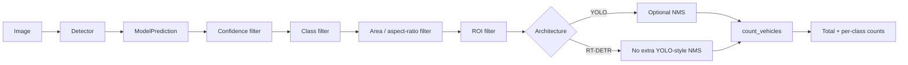
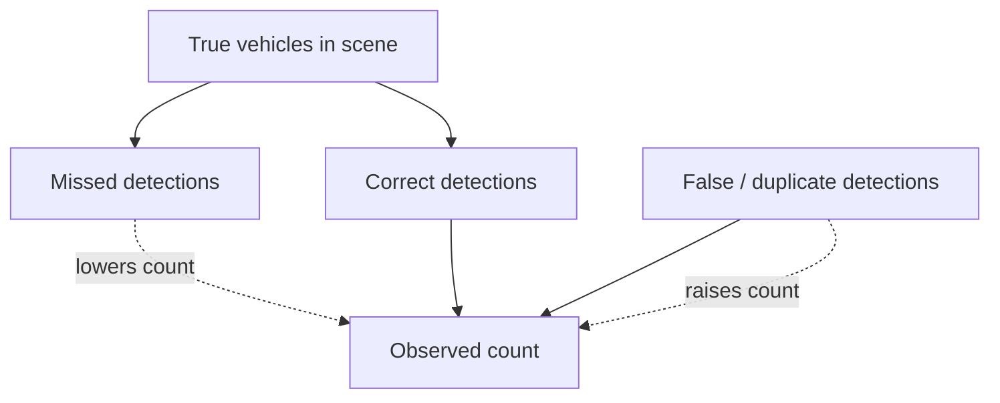
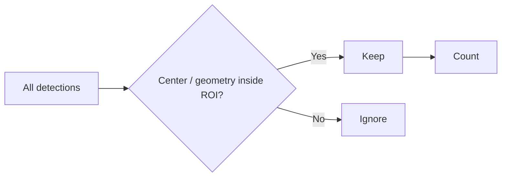
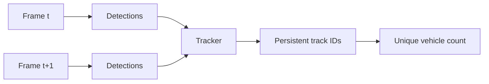

# Counting Methodology

AeroNetra's current counting method is intentionally simple: **one valid detection box in one image contributes one object to that image's count**.


Image-level counting is not unique vehicle counting across time. Unique counting requires tracking and persistent identities across video frames.


## Counting pipeline

## Core functions

| Function                   | Purpose                                           |
| -------------------------- | ------------------------------------------------- |
| `count_vehicles()`         | Return total and per-class counts                 |
| `filter_by_area()`         | Remove implausibly small/large boxes              |
| `filter_by_aspect_ratio()` | Reject extreme shapes                             |
| `filter_by_roi()`          | Restrict counting to a region                     |
| `apply_nms()`              | Suppress overlapping duplicates where appropriate |

## Why a count can be wrong

Typical aerial-imagery failure modes include:

* tiny vehicles occupying very few pixels
* occlusion from trees, buildings or nearby vehicles
* dense traffic where boxes strongly overlap
* class confusion between similar vehicle types
* partial vehicles at image boundaries
* domain shift between pretraining imagery and drone viewpoints
* overly low confidence thresholds producing false positives
* overly aggressive suppression removing real neighboring vehicles

## ROI counting

A Region of Interest is useful when the question is local—for example, “how many vehicles are inside this road segment?” rather than “how many detections exist anywhere in the image?”

## Interpreting results

A count should be reported together with the conditions that produced it: model, weights, dataset/image, thresholds, input size and filtering steps. Otherwise two numbers that look comparable may come from different pipelines.

## What Phase 3 changes

When video tracking is introduced, the logic becomes:

That is fundamentally different from summing boxes frame by frame.
