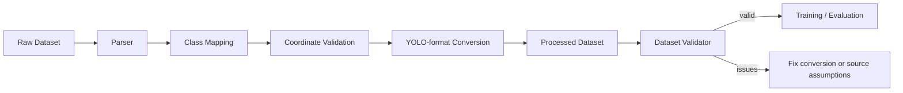
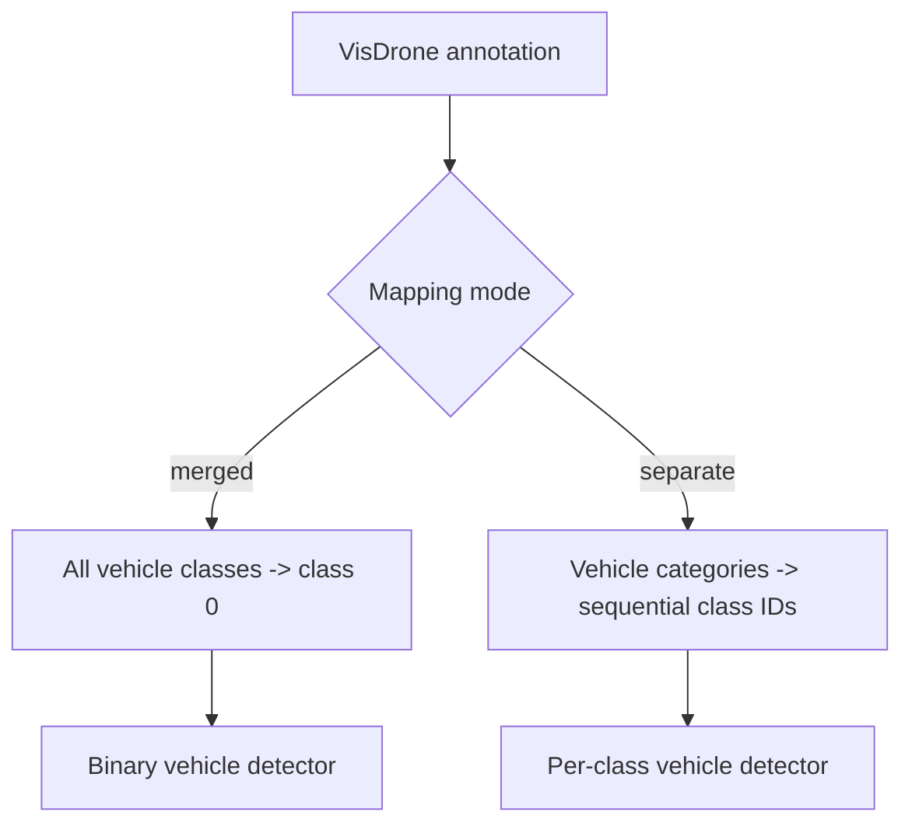

# Datasets Guide

AeroNetra treats dataset handling as part of the research pipeline, not as an afterthought. Raw data stays untouched, conversions are explicit, and validation happens before training.

## Dataset lifecycle



## Supported status

| Dataset       | Intended use                     | Status            |
| ------------- | -------------------------------- | ----------------- |
| **VisDrone**  | Primary aerial detection dataset | ✅ Implemented     |
| **UAVDT**     | Drone traffic detection/tracking | ⚠️ Stub only      |
| **UA-DETRAC** | Optional domain comparison       | ⬜ Not implemented |
| Test fixtures | Unit/local validation            | ✅ Included        |


`src/aeronetra/datasets/uavdt.py` is a stub that raises `NotImplementedError`. Do not describe UAVDT as supported until a parser, tests and configuration are implemented.


## Directory contract

```
data/
├── raw/        # original, immutable files
├── interim/    # temporary transformations
├── processed/  # model-ready converted data
└── samples/    # small local/test subsets
```

Use `DATASET_DIR` or the project configuration helpers instead of hardcoded absolute paths.

## VisDrone class mapping

The implemented converter lives in `src/aeronetra/datasets/visdrone.py`.

| VisDrone ID | Category        | Vehicle target |
| :---------: | --------------- | :------------: |
|      0      | ignored region  |       No       |
|      1      | pedestrian      |       No       |
|      2      | people          |       No       |
|      3      | bicycle         |       Yes      |
|      4      | car             |       Yes      |
|      5      | van             |       Yes      |
|      6      | truck           |       Yes      |
|      7      | tricycle        |       Yes      |
|      8      | awning-tricycle |       Yes      |
|      9      | bus             |       Yes      |
|      10     | motor           |       Yes      |
|      11     | others          |       No       |

## Conversion modes



* **Merged:** useful when the main question is “vehicle or not?”
* **Separate:** useful when class-specific counts matter.

## Important converter functions

| Function                   | Purpose                                       |
| -------------------------- | --------------------------------------------- |
| `parse_visdrone_row()`     | Parse one annotation row                      |
| `map_category()`           | Map original category to target class         |
| `convert_to_yolo_format()` | Normalize coordinates and clip boundaries     |
| `convert_dataset()`        | Convert an entire split and return statistics |

Always retain the returned conversion statistics; they help catch unexpected class loss or malformed annotations.

## Validate before training

```bash
python scripts/validate_dataset.py --dataset-dir <path> --num-classes <n>
```

The validator checks image/label pairing, malformed labels, zero-area boxes, invalid IDs, duplicate rows, boundary errors, tiny boxes and extreme aspect ratios.

## Why aerial data is difficult

A vehicle that occupies hundreds of pixels in a street-level photograph may occupy only a few pixels in drone imagery. Dense traffic also creates overlapping boxes and occlusion. This makes annotation quality, input resolution and threshold selection especially important.


Dataset conversion does not solve small-object detection. It only ensures the model receives labels in a consistent, valid format.

