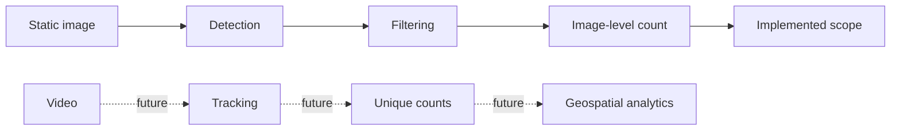
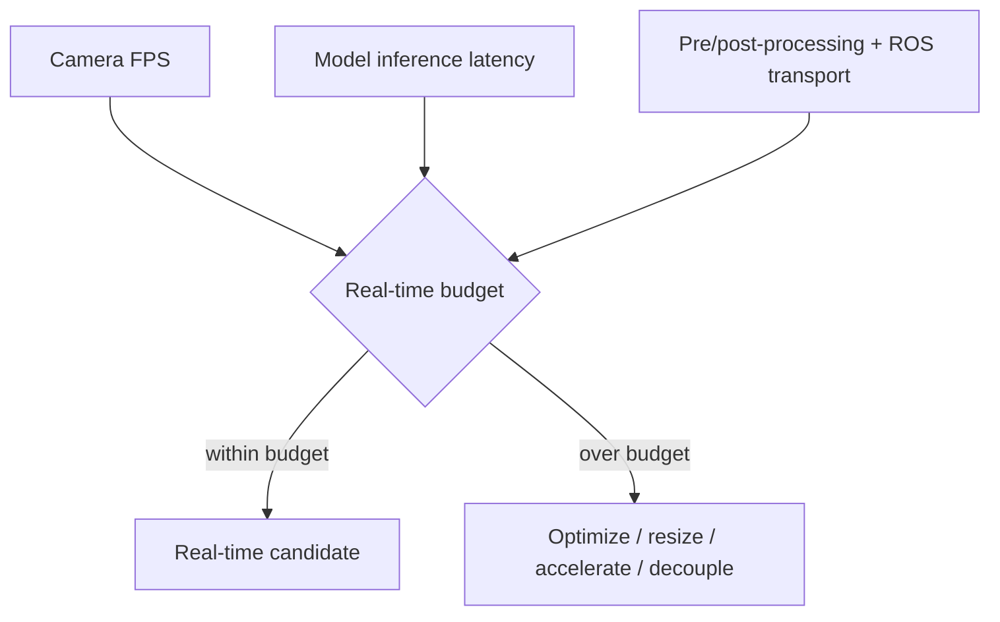

# Limitations

A professional research project should make its limitations easy to find. AeroNetra currently focuses on **static aerial-image detection and image-level counting**, and several later capabilities are intentionally incomplete.

## Capability boundary

## Detection risks

| Limitation                | Practical impact                                  | Mitigation direction                   |
| ------------------------- | ------------------------------------------------- | -------------------------------------- |
| Tiny aerial objects       | Missed vehicles                                   | Aerial fine-tuning, resolution studies |
| Dense scenes              | Suppression/cap-related undercount                | Tune thresholds and max detections     |
| Domain shift              | Poor transfer from ground imagery                 | Validate on aerial datasets            |
| Confidence mismatch       | Unfair cross-model comparisons                    | Tune operating point per model         |
| Single-image adapter flow | No native batch/video pipeline                    | Add only when phase scope expands      |
| Architecture-specific NMS | Incorrect post-processing can remove real objects | Keep behavior model-aware              |

## Dataset risks

* raw annotations may contain malformed or boundary-crossing boxes
* class definitions differ across datasets
* tiny boxes dominate some aerial scenes
* a converter can silently change class distribution if statistics are not checked

Always run the validator before training.

## Incomplete modules

| Area                      | Current status                  |
| ------------------------- | ------------------------------- |
| UAVDT parser              | Stub / not implemented          |
| Evaluation package        | Incomplete                      |
| Generic utilities package | Minimal/incomplete              |
| Experiment configs        | Not fully populated             |
| Model-specific configs    | Not fully populated             |
| Tracking                  | Not implemented in core Phase 1 |


Do not turn planned modules into documentation claims. A documented roadmap item is not an implemented feature.


## Performance reality

Deep detectors can reduce live-camera responsiveness when inference runs on the same CPU/GPU resources as visualization or simulation. Real deployment work will need measured profiling rather than assuming notebook speed translates to a UAV pipeline.

## Research interpretation

Results should always be tied to the exact dataset split, model weights, thresholds, input size, device and post-processing path. Without that metadata, comparisons are descriptive rather than reproducible.
