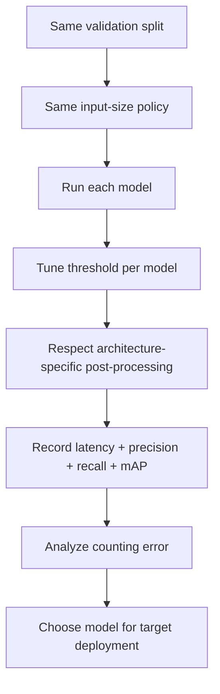
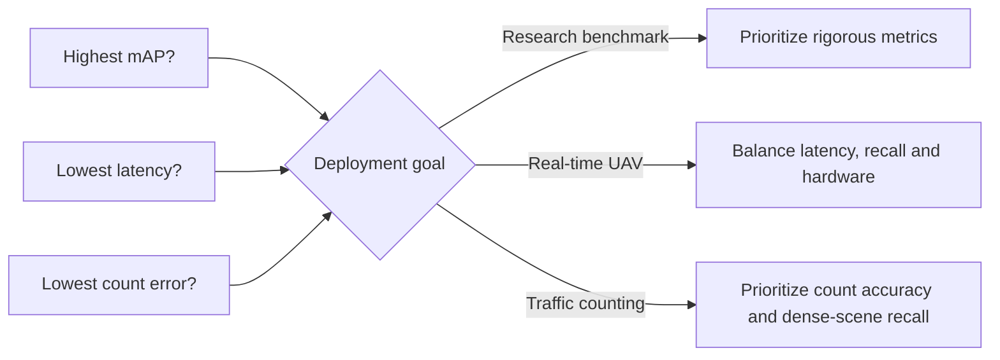

# Model Comparison

A fair model comparison is more than running two weight files with the same confidence value. Architectures can differ in confidence calibration, post-processing, latency and behavior in dense scenes.

## Fair evaluation workflow

## Architecture-level differences

| Topic                  | YOLO family                             | RT-DETR                               |
| ---------------------- | --------------------------------------- | ------------------------------------- |
| Prediction style       | Dense detector outputs                  | Transformer-based end-to-end outputs  |
| External NMS           | Common/expected                         | Should not be blindly added           |
| Confidence calibration | Model-specific                          | Model-specific                        |
| Dense-scene behavior   | Sensitive to suppression/max detections | Different duplicate-handling behavior |
| Best use               | Must be measured                        | Must be measured                      |


Do not label one architecture “best” based on a single screenshot, one confidence threshold or a different validation subset.


## Thresholds are not universal

A score of `0.25` from one architecture is not guaranteed to represent the same operating point as `0.25` from another. Tune thresholds on held-out validation data for the precision/recall balance you need.

## Dense-scene ceiling

If `max_detections` is set too low, a model can hit the ceiling before it has a chance to represent all objects in a crowded scene. Always record this setting when comparing vehicle counts.

## Metrics to record

| Metric            | Why it matters                              |
| ----------------- | ------------------------------------------- |
| Precision         | How many reported detections are correct    |
| Recall            | How many real vehicles are found            |
| mAP@50            | Detection quality at a looser IoU criterion |
| mAP@50-95         | More demanding localization quality         |
| Inference latency | Deployment feasibility                      |
| Count error       | Direct relevance to the counting objective  |

## Decision principle

The right model depends on the problem definition and hardware constraints, not on model generation number alone.
