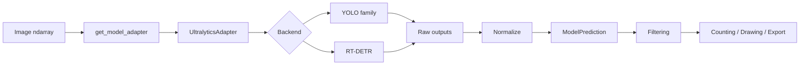
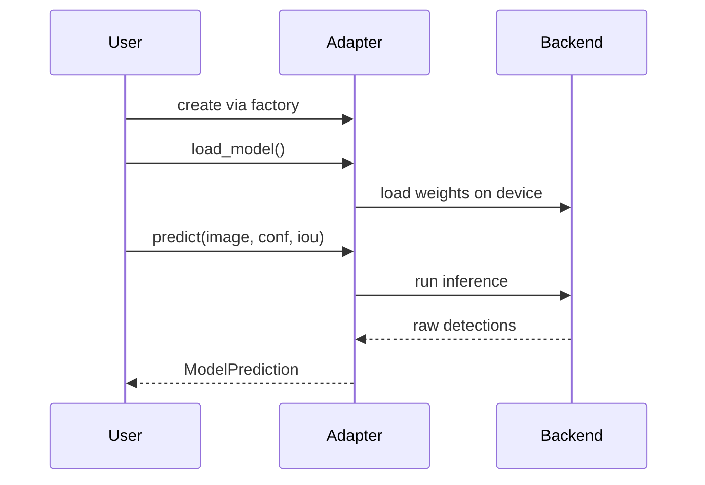
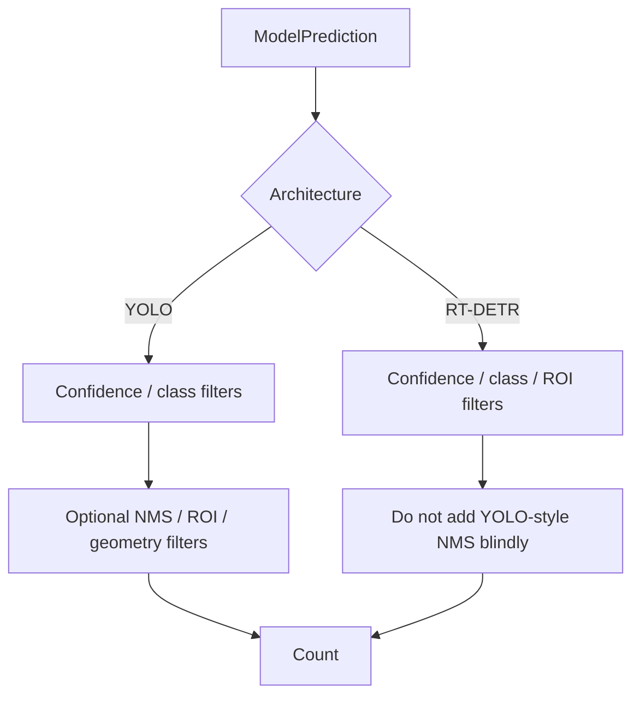

# Model Inference Guide

AeroNetra isolates model-specific behavior behind a detector adapter. This lets counting, visualization and experiment code work with one prediction format even when the underlying architecture changes.

## Inference architecture



## Lifecycle



## Basic usage

```python
from aeronetra.detection.adapters import get_model_adapter

adapter = get_model_adapter(
    model_name="YOLOv8",
    weights_path="outputs/models/yolov8n.pt",
    class_names={0: "vehicle"},
    device="cuda",
)

adapter.load_model()
prediction = adapter.predict(image, conf_thresh=0.25, iou_thresh=0.45)
```

Then operate on the standardized result:

```python
filtered = prediction.filter_by_confidence(0.5)

from aeronetra.counting.ops import count_vehicles
from aeronetra.counting.drawing import draw_detections

total, by_class = count_vehicles(filtered.detections)
annotated = draw_detections(image.copy(), filtered.detections)
```

## Standard output model

### `ModelPrediction`

Contains detections, image dimensions and inference timing.

### `Detection`

Contains the bounding box, class ID, class name, confidence, source model and image identifier.

### `BoundingBox`

Uses absolute pixel coordinates in `xyxy` order and exposes useful geometry such as width, height, area and center.

## Post-processing is architecture-aware




RT-DETR is designed as an end-to-end detector. Do not automatically apply the same external NMS path used for YOLO outputs.


## Common failures

| Problem                    | Meaning                                  | Fix                                                                  |
| -------------------------- | ---------------------------------------- | -------------------------------------------------------------------- |
| `predict()` before loading | Adapter is not initialized               | Call `load_model()` first                                            |
| Missing weights            | Path is invalid                          | Check explicit weights path                                          |
| Unsupported model name     | Factory cannot resolve backend           | Use a supported adapter name                                         |
| CPU appears slow           | Deep detector inference is compute-heavy | Use GPU or reduce workload/input size after measuring quality impact |

## Reproducible inference

For comparisons, record model name/version, weights, dataset split, image size, confidence threshold, IoU threshold, seed, device and inference time. A screenshot alone is not an experiment result.
