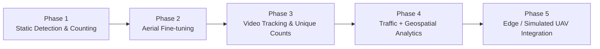
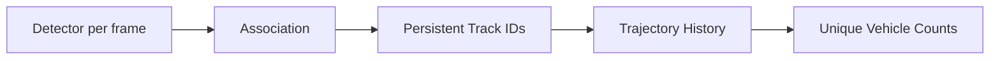
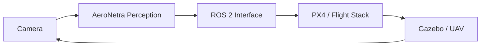

# Research Scope

AeroNetra is intentionally phased. Each stage should create a reliable foundation for the next rather than combining detection, tracking, mapping and deployment before the earlier layers are measurable.

## Roadmap

| Phase | Primary question                                                       | Status     |
| ----- | ---------------------------------------------------------------------- | ---------- |
| **1** | Can we detect and count vehicles reliably in individual aerial images? | 🟢 Current |
| **2** | Can aerial fine-tuning improve detection quality?                      | Planned    |
| **3** | Can vehicles retain identities across frames?                          | Planned    |
| **4** | Can tracks become useful traffic/geospatial signals?                   | Planned    |
| **5** | Can the pipeline operate efficiently in a UAV or simulation loop?      | Planned    |

## Phase 1 — Detection and image counting

Build the reusable research foundation:

* standardized detector adapter
* validated prediction data structures
* VisDrone conversion and validation
* filtering, ROI and counting utilities
* model-comparison workflow
* reproducible experiment metadata

**Success means:** the same image and configuration can be rerun and interpreted consistently.

## Phase 2 — Aerial fine-tuning

Use aerial datasets to improve performance on small objects, top-down viewpoints and dense traffic. Training belongs on GPU-capable infrastructure such as Kaggle when local hardware is insufficient.

## Phase 3 — Video tracking

This phase changes the meaning of “count”: persistent identity replaces independent boxes.

## Phase 4 — Analytics

Potential outputs include traffic density, directional flow, trajectory statistics and eventually geospatially grounded measurements. These require calibrated assumptions and should not be inferred from raw bounding boxes alone.

## Phase 5 — UAV / edge integration

The long-term integration layer can connect perception to simulated or real UAV systems, with attention to model optimization, real-time latency, ROS 2 messaging and flight-stack boundaries.


This diagram describes the intended integration direction. It does not mean the later phases are already implemented in the core computer-vision package.

