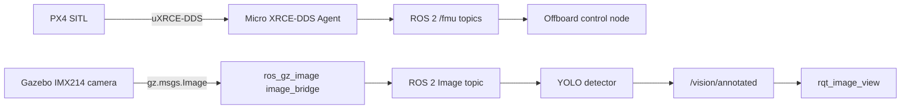

# PX4 + ROS 2 + Gazebo Integration

This section contains the AeroNetra simulation environment on **Ubuntu 24.04 Noble**, **ROS 2 Jazzy**, **PX4 SITL**, and **Gazebo**. It intentionally separates two integration paths that use different bridges.


The camera/vision workflow is based on the working steps recorded in the AeroNetra development notes and tested with `gz_x500_depth`, the IMX214 camera, a Gazebo Prius, and a VisDrone-trained `best.pt` model.


## Two independent integration paths



| Path                | Purpose                                            | Required bridge             |
| ------------------- | -------------------------------------------------- | --------------------------- |
| **Flight control**  | PX4 telemetry, `/fmu/*` topics, offboard commands  | Micro XRCE-DDS Agent        |
| **Computer vision** | Gazebo camera frames → YOLO → annotated ROS images | `ros_gz_image image_bridge` |

**Micro XRCE-DDS does not carry Gazebo camera frames into ROS 2.** For a camera-only CV test, Micro XRCE-DDS and QGroundControl are not required.

## Quickstart (fresh machine)

Everything needed to run the two paths is in this repository. On Ubuntu 24.04 with ROS 2 Jazzy and PX4 already installed:

```bash
cd px4_ros2_jazzy_gazebo_harmonic_sitl

# 1. Install any missing apt dependencies (never touches PX4/ROS 2/Gazebo).
scripts/install_missing_only.sh

# 2. Assemble ~/px4_ros2_ws (links the packages, clones px4_msgs, builds),
#    and create the Ultralytics virtualenv for the YOLO detector.
INSTALL_CV=1 scripts/setup_workspace.sh

# 3. Copy your trained VisDrone model into place.
cp /path/to/best.pt ~/px4_ros2_ws/models/best.pt
```

Then run each path in its own terminal.

**Computer-vision path (four terminals):**

```bash
scripts/run_px4_gazebo.sh     # Terminal 1: PX4 SITL + Gazebo (gz_x500_depth)
scripts/run_image_bridge.sh   # Terminal 2: bridge the IMX214 camera into ROS 2
scripts/run_cv_detector.sh    # Terminal 3: VisDrone YOLO detector
scripts/run_cv_viewer.sh      # Terminal 4: rqt_image_view on /vision/annotated
```

**Flight-control path (four terminals):**

```bash
scripts/run_px4_gazebo.sh       # Terminal 1: PX4 SITL + Gazebo
scripts/run_agent.sh            # Terminal 2: Micro XRCE-DDS Agent (udp4 :8888)
scripts/verify_topics.sh        # Terminal 3: confirm /fmu/* topics
scripts/run_offboard_node.sh    # Terminal 4: offboard control node
```


The `px4_msgs` branch must match your PX4 firmware release. Override it with `PX4_MSGS_BRANCH=release/1.16 scripts/setup_workspace.sh` if needed.


## Where to start

1. Continuing from an Existing Setup — protect a working local installation.
2. Environment Report — verify Ubuntu, ROS 2, Gazebo and PX4 prerequisites.
3. Choose the workflow you need:
   * Running the Simulation for PX4 telemetry/offboard control.
   * Verified YOLO Camera Pipeline for the tested live CV path.
4. Use Troubleshooting when a bridge, topic, detector, or arming check fails.

## Repository layout

```
px4_ros2_jazzy_gazebo_harmonic_sitl/
├── README.md
├── requirements-cv.txt
├── cv_nodes/
│   ├── yolo_car_detector.py      # VisDrone YOLO detector (ROS 2 node)
│   ├── simple_bbox.py            # OpenCV background bounding-box node
│   └── vision_tracking.py        # OpenCV position/size tracking node
├── docs/
│   ├── README.md
│   ├── continue-existing-setup.md
│   ├── environment-report.md
│   ├── run-simulation.md
│   ├── verified-yolo-camera-pipeline.md
│   ├── troubleshooting.md
│   └── actual-simulation-record/ # the recorded run, experiment by experiment
├── scripts/                      # setup + per-terminal run scripts
└── ros2_ws/src/px4_offboard_py/  # offboard control ROS 2 package
```


A simulation workaround that disables PX4's data-link-loss action is documented only for local SITL troubleshooting. It must **not** be treated as a safe default for real aircraft.

