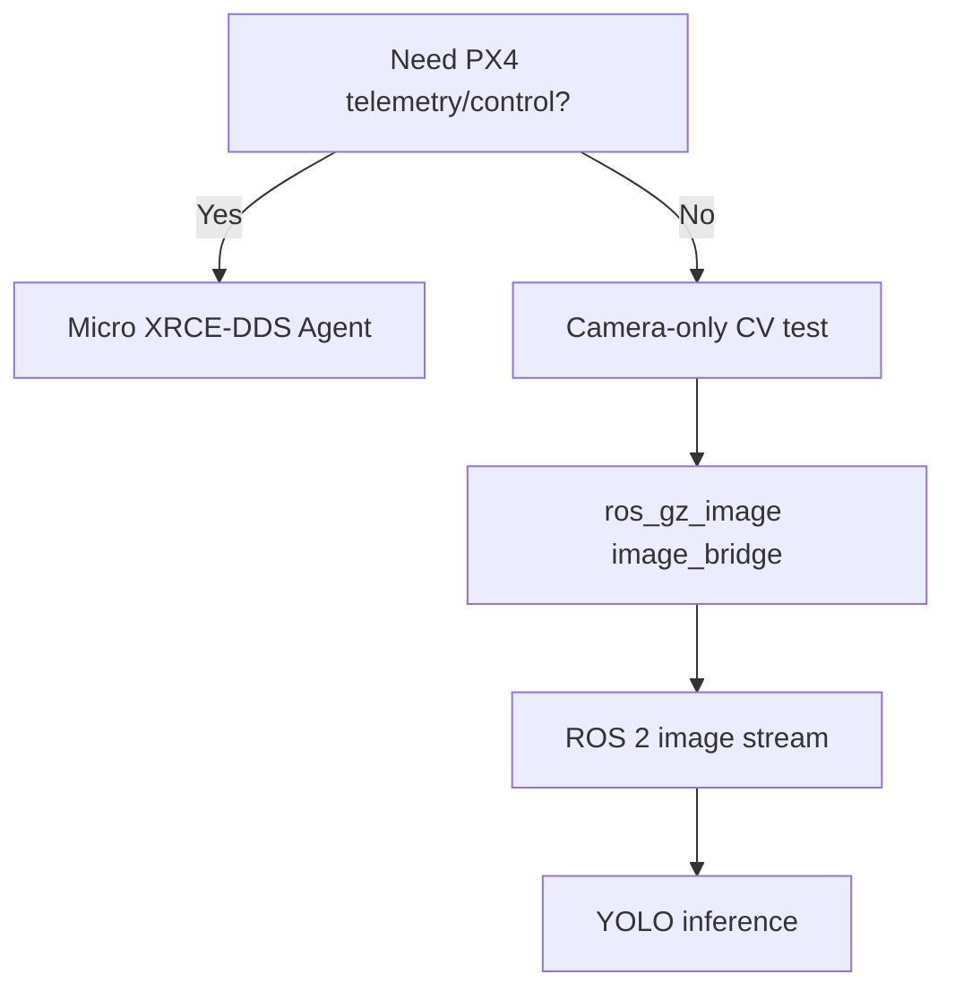

# Simulation Developer Guides

Use this section as the operational reference for AeroNetra's PX4/ROS 2/Gazebo work.

## Guides

| Guide                                                             | Use it when                                                                               |
| ----------------------------------------------------------------- | ----------------------------------------------------------------------------------------- |
| Continuing from an Existing Setup                                 | You already have PX4 and ROS 2 installed and want to avoid destructive setup changes.     |
| Environment Report                                                | You need to verify the expected software and workspace before running anything.           |
| Running the Simulation                                            | You are testing PX4 telemetry and offboard control through Micro XRCE-DDS.                |
| [Verified YOLO Camera Pipeline](verified-yolo-camera-pipeline.md) | You want the tested `gz_x500_depth` camera → ROS 2 → YOLO → `/vision/annotated` workflow. |
| Troubleshooting                                                   | A topic, bridge, detector, viewer, or preflight check is failing.                         |

## Important architecture boundary

Do not debug a missing camera stream by changing Micro XRCE-DDS. The Gazebo camera and PX4 telemetry are separate transport paths.
