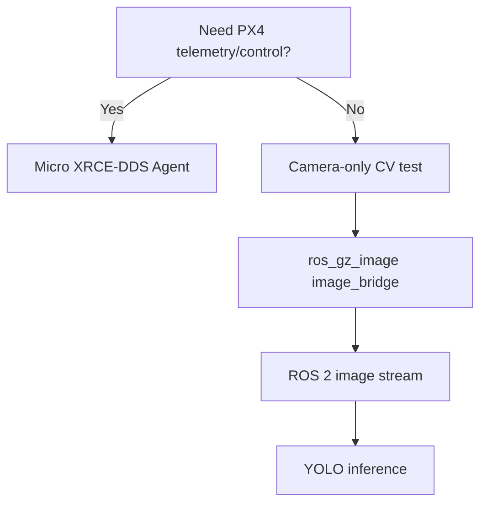

# Simulation Developer Guides

Use this section as the operational reference for AeroNetra's PX4/ROS 2/Gazebo work.

## Guides

| Guide                                                             | Use it when                                                                               |
| ----------------------------------------------------------------- | ----------------------------------------------------------------------------------------- |
| [Continuing from an Existing Setup](continue-existing-setup.md)   | You already have PX4 and ROS 2 installed and want to avoid destructive setup changes.     |
| [Environment Report](environment-report.md)                       | You need to verify the expected software and workspace before running anything.           |
| [Running the Simulation Demonstration](run-simulation.md)         | You want the recorded four-terminal camera-and-YOLO startup, step by step.                |
| [Verified YOLO Camera Pipeline](verified-yolo-camera-pipeline.md) | You want the tested `gz_x500_depth` camera → ROS 2 → YOLO → `/vision/annotated` workflow. |
| [Actual Simulation Record](actual-simulation-record/README.md)    | You want the raw experiment history, source code and observed failure notes.              |
| [Troubleshooting](troubleshooting.md)                             | A topic, bridge, detector, viewer, or preflight check is failing.                         |


Run `scripts/setup_workspace.sh` once, then drive the simulation with the per-terminal scripts: `run_px4_gazebo.sh`, `run_image_bridge.sh`, `run_cv_detector.sh`, `run_cv_viewer.sh`. See the [section README](../README.md) for the full quickstart.


## Important architecture boundary

```mermaid
flowchart TD
    A[Need PX4 telemetry/control?] -->|Yes| B[Micro XRCE-DDS Agent]
    A -->|No| C[Camera-only CV test]
    C --> D[ros_gz_image image_bridge]
    D --> E[ROS 2 image stream]
    E --> F[YOLO inference]
```

Do not debug a missing camera stream by changing Micro XRCE-DDS. The Gazebo camera and PX4 telemetry are separate transport paths.
