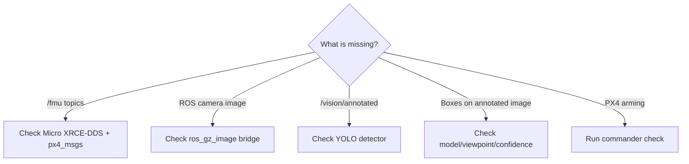

# Troubleshooting

Use the failure boundary to decide what to inspect. PX4 telemetry and Gazebo camera images are **different transport paths**.

## Quick diagnosis



## Observed PX4 SITL arming issue — Ubuntu 24.04 + Gazebo

Environment recorded in the experiment:

* OS: Ubuntu 24.04 Noble
* Simulator: Gazebo / PX4 SITL
* PX4 vehicle: `gz_x500_depth`
* ROS 2 bridge: Micro XRCE-DDS Agent

The PDF records the following failure after PX4 SITL and Gazebo were otherwise running correctly:

```
commander takeoff
Arming denied: Resolve system health failures first
```

Running:

```
commander check
```

showed:

```
Preflight Fail: No connection to the GCS
```

The recorded cause was that the saved PX4 parameter `NAV_DLL_ACT` was treating the missing GCS/data-link condition as a blocking preflight health failure in the local setup.

The exact SITL fix used was:

```
param set NAV_DLL_ACT 0
param save
commander check
commander takeoff
```


This was a local simulation/SITL workaround. The data-link-loss failsafe is an important real-flight safety feature and should not be disabled casually on a physical aircraft.


## Observed Gazebo camera not appearing in ROS 2

The Gazebo camera topic was visible with:

```bash
gz topic -l
```

but:

```bash
ros2 topic list | grep -i image
```

returned no ROS 2 image topic even though Gazebo contained:

```
/world/default/model/x500_depth_0/link/camera_link/sensor/IMX214/image
```

### Root cause recorded in the simulation

PX4 Micro XRCE-DDS does not bridge Gazebo camera images into ROS 2. The image topic must be bridged separately with `ros_gz_image`.

The run also exposed a shell-scope problem: `GZ_IMAGE_TOPIC` became empty when commands were moved to another terminal because shell variables do not persist between terminals.

### Exact repair sequence

```bash
gz topic -l | grep '/IMX214/image$'
export GZ_IMAGE_TOPIC="/world/default/model/x500_depth_0/link/camera_link/sensor/IMX214/image"
gz topic -i -t "$GZ_IMAGE_TOPIC"
source /opt/ros/jazzy/setup.bash
ros2 run ros_gz_image image_bridge "$GZ_IMAGE_TOPIC"
```

In a new terminal:

```bash
source /opt/ros/jazzy/setup.bash
ros2 topic list | grep -i image
ros2 topic hz /world/default/model/x500_depth_0/link/camera_link/sensor/IMX214/image
ros2 run rqt_image_view rqt_image_view
```

Select:

```
/world/default/model/x500_depth_0/link/camera_link/sensor/IMX214/image
```

The final camera path recorded by the simulation is:

```
Gazebo camera
→ ros_gz_image image_bridge
→ ROS 2 image topic
→ YOLO detector
→ /vision/annotated
```

## No `/fmu/` topics

When PX4 telemetry/control is required, start and verify Micro XRCE-DDS separately. This is not part of the camera bridge itself.

```bash
ros2 topic list | grep '^/fmu/'
```

If empty, check that `MicroXRCEAgent` is running when telemetry/control is required, UDP port 8888 is available, `px4_msgs` is built and compatible, and the terminals use a consistent ROS environment/domain.

## Raw camera works but `/vision/annotated` is absent

The detector may not be running, may have failed during startup, or may be subscribed to the wrong topic.

```bash
ros2 node list
ros2 topic list | grep vision
```

Expected node:

```
/yolo_car_detector
```

Restart with the actual bridged image topic:

```bash
source /opt/ros/jazzy/setup.bash
source ~/px4_ros2_ws/yolo_venv/bin/activate
export IMAGE_TOPIC="$(
  ros2 topic list |
  grep '/IMX214/image$' |
  head -n 1
)"
export YOLO_MODEL="$HOME/px4_ros2_ws/models/best.pt"
python3 \
  ~/px4_ros2_ws/aeronetra_cv/yolo_car_detector.py
```

## `/vision/annotated` updates but no car is detected

The PDF records these likely causes:

* car is too small;
* car is partially outside the frame;
* camera angle differs too much from VisDrone;
* Gazebo car texture is unrealistic;
* confidence threshold is too high;
* simulation-to-real visual domain gap.

For diagnosis:

```bash
export YOLO_CONF="0.08"
export YOLO_IMGSZ="640"
```

Then restart the detector and reposition the car so its complete roof and body are visible from an elevated angle.

## rqt shows raw image without boxes

Raw camera:

```
/world/default/model/x500_depth_0/link/camera_link/sensor/IMX214/image
```

YOLO output:

```
/vision/annotated
```

Select `/vision/annotated`.

## CPU inference makes the feed slow

The recorded CPU fallback is:

```bash
export YOLO_IMGSZ="416"
export PROCESS_EVERY_N_FRAMES="2"
```

This reduces compute cost but can make small-object detection harder.

## Model file reports permission denied

Do not execute the model directly:

```bash
~/px4_ros2_ws/models/best.pt
```

A `.pt` file is model data, not an executable program. It must be loaded through Python/Ultralytics.

For the complete experiment record, including the exact recorded detector source code and daily startup sequence, see Actual Simulation Record.
