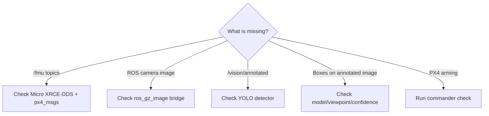

# Troubleshooting

Use the failure boundary to decide what to inspect. PX4 telemetry and Gazebo camera images are **different transport paths**.

## Quick diagnosis



## 1. No `/fmu/` topics

**Symptom:**

```bash
ros2 topic list | grep '^/fmu/'
```

returns nothing.

Check:

* `MicroXRCEAgent` is running when telemetry/control is required.
* UDP port 8888 is available.
* `px4_msgs` is built and compatible with the PX4 firmware version.
* All terminals use a consistent ROS environment/domain.

## 2. `/fmu/` topic exists but `ros2 topic echo` is empty

Try Best Effort QoS:

```bash
ros2 topic echo --qos-reliability best_effort /fmu/out/vehicle_status
```

Also verify `ROS_DOMAIN_ID` and PX4/`px4_msgs` message-version compatibility.

## 3. Offboard node runs but the vehicle does not arm

Check:

* PX4 and `px4_msgs` versions match.
* Offboard setpoints continue above PX4's minimum rate.
* `/fmu/out/vehicle_local_position` is valid.
* `commander check` reports no blocking preflight condition.

### Observed local SITL GCS failure

The tested environment produced:

```
Arming denied: Resolve system health failures first
Preflight Fail: No connection to the GCS
```

For **local SITL only**, the working console workaround was:

```
param set NAV_DLL_ACT 0
param save
commander check
commander takeoff
```


Do not treat disabled data-link-loss handling as a real-aircraft configuration recommendation. This entry exists only to reproduce the tested local simulation state.


## 4. `GZ_IMAGE_TOPIC` is empty

Typical error:

```
Invalid topic. Topic must not be empty.
```

Possible causes:

* Gazebo is not running.
* `gz_x500_depth` has not finished loading.
* The IMX214 topic has not appeared yet.
* The variable was defined in another terminal.

Fix in the current shell:

```bash
export GZ_IMAGE_TOPIC="$(gz topic -l | grep '/IMX214/image$' | head -n 1)"
echo "$GZ_IMAGE_TOPIC"
gz topic -i -t "$GZ_IMAGE_TOPIC"
```

Expected message type: `gz.msgs.Image`.

## 5. Gazebo camera exists but ROS 2 has no image topic

**Root cause:** Gazebo image topics do not automatically become ROS 2 topics, and Micro XRCE-DDS does not bridge the camera.

```bash
source /opt/ros/jazzy/setup.bash
ros2 run ros_gz_image image_bridge "$GZ_IMAGE_TOPIC"
```

Keep the bridge terminal running.

## 6. Raw camera works but `/vision/annotated` is absent

The detector is not running, failed during startup, or subscribed to the wrong topic.

```bash
ros2 node list
ros2 topic list | grep vision
```

Expected:

```
/yolo_car_detector
/vision/annotated
```

## 7. `/vision/annotated` updates but no car is detected

If annotated frames are arriving, ROS 2 transport is already working. Investigate:

* car scale and framing;
* aerial camera angle;
* Gazebo texture/domain gap;
* occlusion;
* confidence threshold.

For diagnosis:

```bash
export YOLO_CONF="0.08"
export YOLO_IMGSZ="640"
```

Then restart the detector and reposition the vehicle so the roof/body are fully visible from an elevated angle.

## 8. rqt shows a live image but no boxes

Verify the selected topic. Raw camera:

```
/world/default/model/x500_depth_0/link/camera_link/sensor/IMX214/image
```

YOLO output:

```
/vision/annotated
```

Select `/vision/annotated` for inference results.

## 9. CPU inference makes the feed slow

Try:

```bash
export YOLO_IMGSZ="416"
export PROCESS_EVERY_N_FRAMES="2"
```

This reduces compute cost but can make small-object detection harder.

For the full validated sequence, see [Verified YOLO Camera Pipeline](verified-yolo-camera-pipeline.md).
